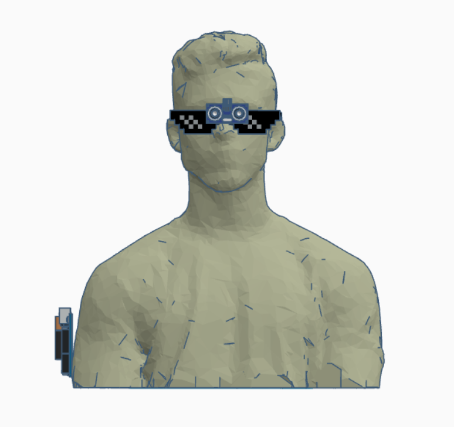
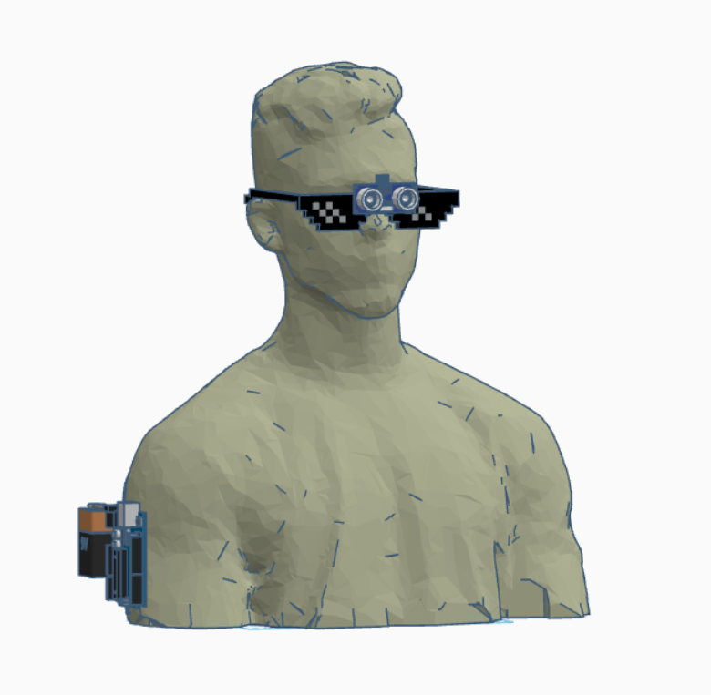
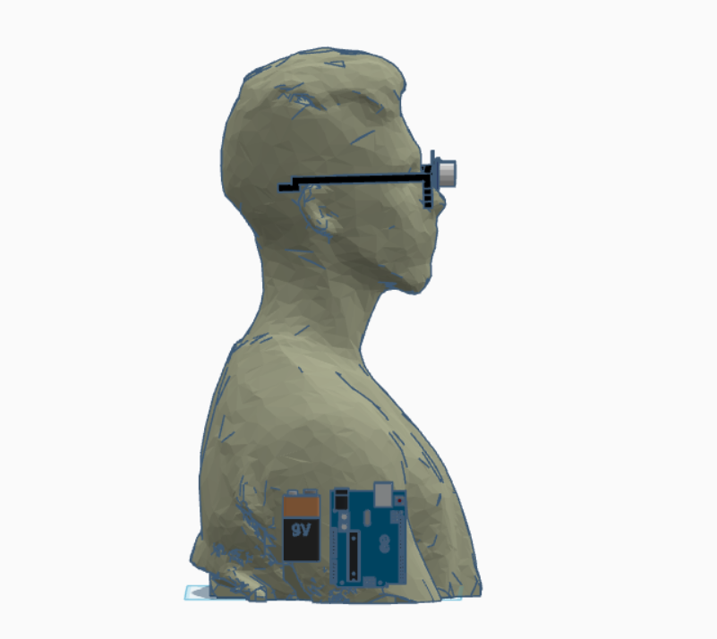

# Readme content / Conteúdo do readme

- [English](#english)
- [Português](#português)

---
## English

# 👨‍🦯‍➡️Echolocation Glasses for the Visually Impaired👨‍🦯‍➡️

A project of a prototype glasses for visually impaired people developed for the Embedded Systems course at UFC (Federal University of Ceará) in Itapajé, Brazil, taught by Professor Juan Sebastian Toquica Arenas.

## Description

This project presents a prototype of glasses equipped with echolocation technology, designed to assist visually impaired individuals in detecting obstacles. Using an Arduino Uno board, the system processes data captured by an ultrasonic sensor (HC-SR04) and converts that information into sound signals, allowing the user to perceive the presence and proximity of objects around them.

<div align="center">
    
    
    
</div>

## Features

- **Obstacle Detection:** Monitors the distance of objects in real time.
- **Audio Feedback:** Emits sound signals when obstacles are detected near the user.
- **Low-Cost Prototype:** Utilizes affordable components, making it easier to reproduce and study the system.

## Technologies Used

- **Hardware:**
  - Board: Arduino Uno
  - Sensor: HC-SR04 Ultrasonic Sensor
  - Actuator: Passive Buzzer
  - Power Supply: 9V Battery
- **Software:**
  - Tinkercad: Prototype modeling and simulation
  - Programming Language: C/C++ (Arduino IDE)

## Installation

1. **Cloning the Repository:**
    ```bash
    git clone https://github.com/pHenrymelo/Ecolocalization-System.git
    ```

2. **Opening the Project in the Arduino IDE:**
    - Launch the Arduino IDE.
    - Open the file `projeto_final_sistemas_embarcados1.ino`.

3. **Configuring the Board and Serial Port:**
    - Select the **Arduino Uno** board.
    - Choose the serial port corresponding to your device.
    - Upload and compile the code.

## Usage

After uploading the code to the Arduino:

- The system starts continuous reading from the ultrasonic sensor.
- When an object is detected at a distance below the limit defined in the code, the buzzer emits a sound signal.
- Parameters such as the distance threshold and the signal intensity can be adjusted in the code as needed.

## License

This project is licensed under the [MIT License](LICENSE).

## Acknowledgements

- **Professor Juan Arenas Sebastian Toquicas:** Project advisor and responsible for the Embedded Systems course at UFC de Itapajé.
- **Contributors:** Pedro Henrique Braga Melo ([Pedro Henrique](https://github.com/pHenrymelo)), Arthur Willame Barroso de Mesquita ([Arthur Willame](https://github.com/ArthurWillameBr)), Nelson Felipe Andrade Araújo ([Nelson Felipe](https://github.com/NelsonFelipe)).
- **Arduino Community:** For the vast amount of resources, tutorials, and support available.

<br>
<br>

---
## Português

# 👨‍🦯‍➡️Óculos de Ecolocalização para Deficientes Visuais👨‍🦯‍➡️

Projeto de um protótipo de óculos para deficientes visuais desenvolvido para a disciplina de Sistemas Embarcados na UFC de Itapajé, ministrada pelo professor Juan Sebastian Toquica Arenas.

## Descrição

Este projeto apresenta um protótipo de óculos com tecnologia de ecolocalização, projetado para auxiliar pessoas com deficiência visual na detecção de obstáculos. Utilizando uma placa Arduino Uno, o sistema processa os dados captados por um sensor ultrassônico (HC-SR04) e converte essas informações em sinais sonoros, permitindo ao usuário perceber a presença e a proximidade de objetos ao seu redor.

<div align="center">
    
    
    
</div>

## Funcionalidades

- **Detecção de Obstáculos:** Monitora a distância de objetos em tempo real.
- **Feedback Sonoro:** Emite sinais sonoros quando obstáculos são detectados próximos ao usuário.
- **Protótipo de Baixo Custo:** Utiliza componentes acessíveis, facilitando a reprodução e o estudo do sistema.

## Tecnologias Utilizadas

- **Hardware:**
  - Placa: Arduino Uno
  - Sensor: HC-SR04 Ultrassônico 
  - Atuador: Buzzer passivo
  - Alimentação: Bateria 9V
- **Software:**
  - Tinkercad: Modelagem e simulação do protótipo
  - Linguagem de programação: C/C++ (IDE do Arduino)


## Instalação

1. **Clonando o repositório:**
    ```bash
    git clone https://github.com/pHenrymelo/Ecolocalization-System.git
    ```

2. **Abrindo o projeto na IDE do Arduino:**
    - Inicie a IDE do Arduino.
    - Abra o arquivo `projeto_final_sistemas_embarcados1.ino`.

3. **Configurando a Placa e a Porta Serial:**
    - Selecione a placa **Arduino Uno**.
    - Escolha a porta serial correspondente ao seu dispositivo.
    - Carregue e compile o código.

## Uso

Após carregar o código no Arduino:

- O sistema inicia a leitura contínua do sensor ultrassônico.
- Quando um objeto é detectado a uma distância inferior ao limite definido no código, o buzzer emite um sinal sonoro.
- Parâmetros como o limite de distância e a intensidade dos sinais podem ser ajustados no código conforme necessário.

## Licença

Este projeto está licenciado sob a [MIT License](LICENSE).

## Agradecimentos

- **Professor Juan Arenas Sebastian Toquicas:** Orientador do projeto e responsável pela disciplina de Sistemas Embarcados na UFC de Itapajé.
- **Colaboradores:** Pedro Henrique Braga Melo ([Pedro Henrique](https://github.com/pHenrymelo)), Arthur Willame Barroso de Mesquita ([Arthur Willame](https://github.com/ArthurWillameBr)), Nelson Felipe Andrade Araújo ([Nelson Felipe](https://github.com/NelsonFelipe)).
- **Comunidade Arduino:** Pela vasta quantidade de recursos, tutoriais e suporte disponível.
